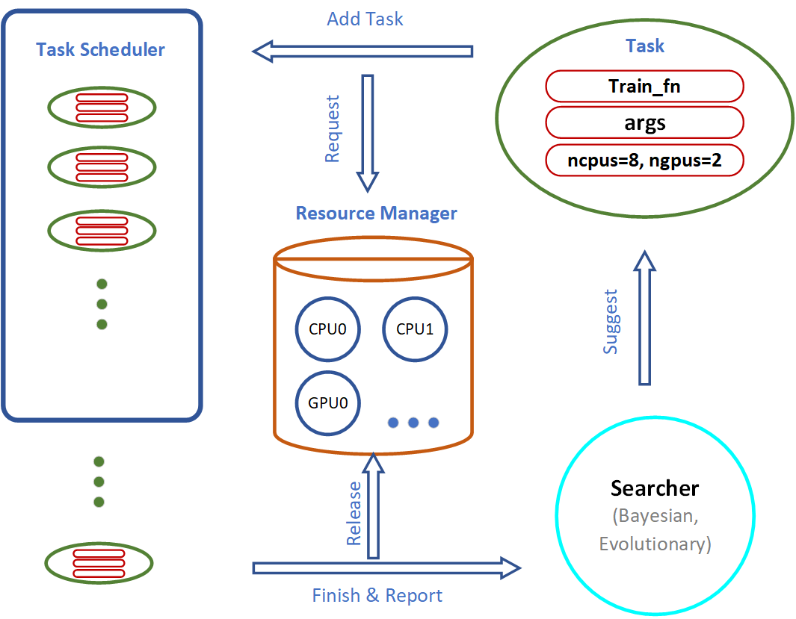
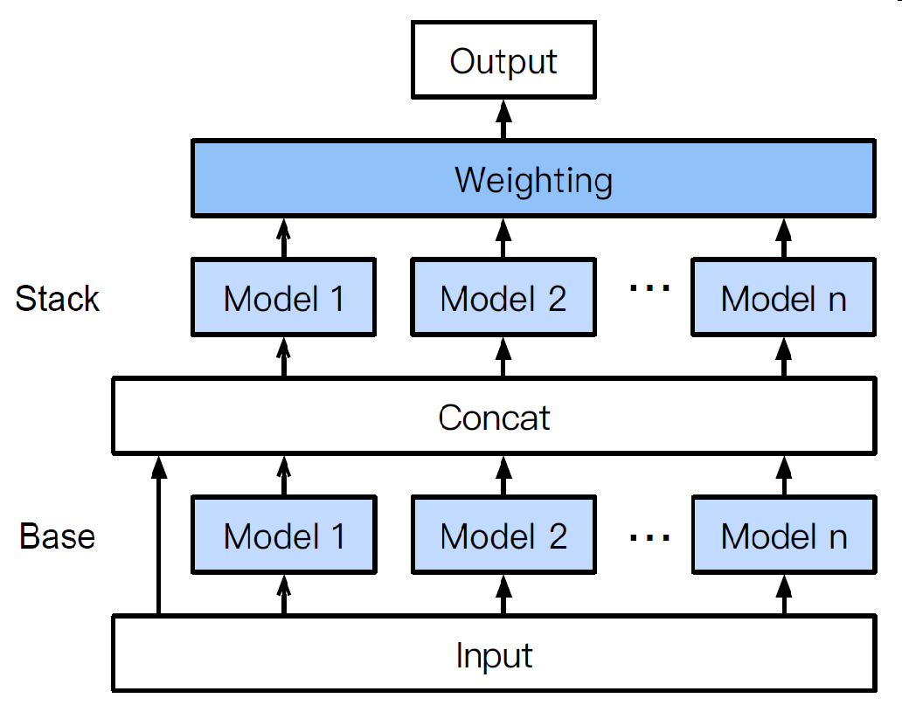
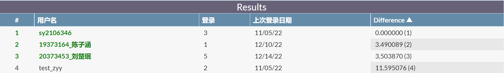

## 机器学习个人作业-报告

200614  刘楚珉  20373453

### 一、问题描述

本题要求根据学生个人基本信息（性别、年龄、父母信息等）和在校表现（参加活动、缺勤等）属性，预测学生的G3成绩。数据集含312条训练数据，83条测试数据，共有30条属性。


### 二、数据预处理

观察数据格式，并统计各属性的值分布情况及特性。

| school | sex  | age  | address | famsize | Pstatus | Medu | Fedu | Mjob     | Fjob     | reason | guardian | traveltime | studytime | failures | schoolsup | famsup | paid | activities | nursery | higher | internet | romantic | famrel | freetime | goout | Dalc | Walc | health | absences | G3   |
| ------ | ---- | ---- | ------- | ------- | ------- | ---- | ---- | -------- | -------- | ------ | -------- | ---------- | --------- | -------- | --------- | ------ | ---- | ---------- | ------- | ------ | -------- | -------- | ------ | -------- | ----- | ---- | ---- | ------ | -------- | ---- |
| 1      | M    | 18   | U       | GT3     | T       | 3    | 2    | services | other    | course | mother   | 2          | 1         | 1        | no        | no     | no   | no         | yes     | no     | yes      | no       | 4      | 4        | 5     | 2    | 4    | 5      | 0        | 8    |
| 4      | F    | 18   | U       | GT3     | T       | 3    | 2    | other    | services | other  | mother   | 1          | 3         | 0        | no        | no     | no   | no         | yes     | yes    | yes      | yes      | 5      | 4        | 3     | 2    | 3    | 1      | 7        | 14   |
| ...    | …    | …    | …       | …       | …       | …    | …    | …        | …        | …      | …        | …          | …         | …        | …         | …      | …    | …          | …       | …      | …        | …        | …      | …        | …     | …    | …    | …      | …        | …    |

- 数值属性：
    - 无明显左右偏情况，或对其取对数/指数后无明显居中。（取对数/指数后数据分布图见文末）
    - school属性仅作为数据序号，与成绩无关，故删去。


- 文字属性：
    - 将文字属性独热处理，转换为数值属性。
    - 大部分属性为二分类，故后续独热处理之后删除二分类属性的末列，降低数据冗余度。（因为后续选用的LightGBM在训练过程中采用互斥特征捆绑算法，即使不提前手工删除这些列，训练时也会删除，所以这个步骤可以省略）


- 标签数据：
    - 分布基本符合高斯分布，但有离群点。——不做处理。


- 各属性之间的相关性：无相关性特别强的属性组。


- 各属性与标签的相关性：相关性均不强。——不额外设置权重。


- 缺失值：无


### 三、模型训练

最终预测的G3成绩是一个数值，选用回归模型 $LightGBM$。 

#### 模型原理

- Boosting

    Boosting指把多个弱学习器相加，产生一个新的强学习器。

    用 $f_i(x)$ 表示各个弱学习器，则Boosting的强学习器就是多个弱学习器串联的结果，表示为
    $$
    F(x)=\sum f_i(x)
    $$

- Gradient Boosting

    迭代过程中，新的学习器的学习目标由残差产生。

    假设已有n-1个弱学习器 $f_i(x)$ 组合而成的强学习器 $F_{n−1}(x)=\displaystyle\sum_{i=1}^{n−1}f_i(x)$ ，则下一个弱学习器  $f_n(x)$ 的学习目标就是 $y-F_{n-1}(x)$，得到新的强学习器
    $$
    F_n(x)=F_{n−1}(x)+f_n(x)
    $$
    梯度下降：残差本质上是二次损失函数 $L(y,F)=\frac{1}{2}(y−F(x))^2$​ 的负梯度，即
    $$
    y−F(x)=-\frac{1}{2}×\frac{∂(y−F(x))^2}{∂F(x)}=−\frac{∂L(y,F(x))}{∂F(x)}
    $$

- GBDT (Gradient Boosting Decision Tree)

GBDT是一个利用弱分类器（CART决策树）迭代训练以得到最优模型的集成算法。具体算法如下：


- LightGBM (Light Gradient Boosting Machine)

    LightGBM是一个实现GBDT算法的框架，支持高效率的并行训练，并且具有更快的训练速度、更低的内存消耗、更好的准确率、支持分布式可以快速处理海量数据。

    其优化思想主要为：

    - 为了解决分裂点数量过多的问题，采用直方图算法，将遍历样本转变为遍历直方图
    - 为了解决样本数量过多的问题，采用单边梯度抽样算法，过滤掉梯度小的样本
    - 为了解决特征数量过多的问题，LightGBM采用互斥特征捆绑算法，使得它能直接支持类别特征

#### 调参训练过程

对模型的以下3个超参数进行了预训练实验：

- num_leaves
- n_estimators
- learning_rate

```python
model = LGBMRegressor()
estimator = GridSearchCV(
    model, parameters, scoring='neg_root_mean_squared_error', cv=5)
estimator.fit(x, y)
print(estimator.best_params_)
print(estimator.best_score_)
```

使用较大的参数取值跨度，缩小最优超参数范围：

```python
parameters = {
    'num_leaves': [10, 20, 30, 40, 50],		# 10
    'n_estimators': [20, 40, 60, 80],		# 20
    'learning_rate': [1e-5, 1e-3, 1e-1],	# 1e-1
}
```

根据上述最优参数取值，确定更小的超参数范围，缩小超参数取值跨度：

```python
parameters = {
    'num_leaves': [i for i in range(3, 11)],		# 4
    'n_estimators': [2*i for i in range(3, 11)],	# 12
    'learning_rate': [0.1*i for i in range(1, 11)],	# 0.2
}
```

更细化至（最）小分度值：

```python
parameters = {
    'num_leaves': [4],										# 4
    'n_estimators': [i for i in range(12, 16)],				# 14
    'learning_rate': [0.01*i+0.3 for i in range(-9, 10)],	# 0.27
}
```


### 四、AutoGluon自动训练（用于对比参考）

AutoGluon是一个开源的AutoML框架，只需一行Python代码即可在一个未处理的表格数据集（如 CSV 文件）上训练出高精度的机器学习模型。与现有的主要关注模型/超参数选择的AutoML框架不同，AutoGluon会将多个模型集成在一起，并将它们叠加在多层中，并且可以更好地利用分配的训练时间，而不是寻找最佳的训练时间。AutoGluon支持提前停止训练，例如，若模型在训练初期的表现已经很糟糕，可以提前终止以释放资源，有利于提高效率。系统架构如图所示：



集成示意如下：



AutoGluon 会按照预定的顺序使用一组定制的模型，进行多层集合学习，如上图所示，目标是通过“好而不同”的模型来优化结果。模型中包含 k-近邻、LightGBM、随机森林、CatBoost、极度随机树、神经网络、XGBoost及他们的一些变式。


### 五、结果提交

共计提交4个版本：

- 以80%训练集+5折交叉验证求出的最优超参数模型：3.503870
    - 该版本是初次尝试时失误将已分割的“训练集中的训练集”用以调参，但结果意外地最优。
- 以全部训练集+5折交叉验证求出的最优超参数模型：3.709317
    - 该版本与AutoGluon所得模型在测试集上的效果一模一样，也很大程度上能说明LightGBM确实是该任务上接近最优的模型。
- 以全部训练集+10折交叉验证求出的最优超参数模型：3.783286
    - 虽然该版本模型在交叉验证中有以上三者中最低的RMSE值，但它和测试集的分布仍有差别。No free lunch.
- AutoGluon训练出来的模型：3.709317




【附录】

附图1：数值属性取对数后分布


附图2：数值属性取指数后分布

